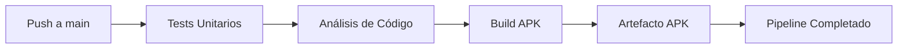

# 🚀 Pipeline CI/CD - PeruFest

## 📋 Descripción del Pipeline

Este proyecto implementa un **Pipeline de Integración y Entrega Continua (CI/CD)** usando **GitHub Actions** que se ejecuta automáticamente ante cada cambio en el código.

## 🎯 Componentes del Pipeline

### 1️⃣ **Tests Unitarios** 🧪
- Ejecuta todos los tests en `test/utils/validators_test.dart`
- Valida 5 funciones de utilidad:
  - ✅ Validación de Email
  - ✅ Seguridad de Contraseña
  - ✅ Calculadora de Descuentos
  - ✅ Validación de Rango
  - ✅ Conversión a Mayúsculas

### 2️⃣ **Análisis de Código** 🔍
- Ejecuta `flutter analyze` para verificar calidad del código
- Detecta:
  - Errores de sintaxis
  - Warnings de estilo
  - Código deprecated
  - Malas prácticas

### 3️⃣ **Build APK** 🚀
- Compila la aplicación Android en modo release
- Genera el archivo `app-release.apk`
- Disponible para descarga por 7 días

### 4️⃣ **Resumen** 📊
- Muestra el estado final del pipeline
- Confirma que todos los pasos fueron exitosos

## 📂 Estructura de Archivos Creados

```
SM2_Examen_CICD/
├── .github/
│   └── workflows/
│       └── ci_cd.yml          ← Configuración del pipeline
├── app_perufest/
│   ├── lib/
│   │   └── utils/
│   │       └── validators.dart  ← Funciones de validación
│   └── test/
│       └── utils/
│           └── validators_test.dart  ← Tests unitarios
└── PIPELINE_CICD.md           ← Esta documentación
```

## 🔄 Flujo de Trabajo



## 🚀 Cómo Activar el Pipeline

### Opción 1: Push a GitHub
```bash
git add .
git commit -m "feat: Agregar pipeline CI/CD con tests unitarios"
git push origin main
```

### Opción 2: Pull Request
1. Crea una rama: `git checkout -b feature/mi-cambio`
2. Haz cambios y commit: `git commit -am "Mi cambio"`
3. Push: `git push origin feature/mi-cambio`
4. Crea un Pull Request en GitHub

## 📊 Ver Resultados del Pipeline

1. Ve a tu repositorio en GitHub: `https://github.com/JersonCh/SM2_Examen_CICD`
2. Click en la pestaña **"Actions"**
3. Verás la lista de ejecuciones del pipeline
4. Click en cualquier ejecución para ver detalles

### Estados Posibles:
- ✅ **Verde**: Todo exitoso
- ❌ **Rojo**: Falló algún paso
- 🟡 **Amarillo**: En progreso
- ⚪ **Gris**: Pendiente/Cancelado

## 📦 Descargar el APK

Después de que el pipeline termine exitosamente:

1. Ve a la pestaña **Actions**
2. Click en la ejecución completada
3. Scroll hasta **Artifacts**
4. Descarga **perufest-apk** (válido por 7 días)

## 🧪 Ejecutar Tests Localmente

```bash
# Tests unitarios
cd app_perufest
flutter test test/utils/validators_test.dart

# Análisis de código
flutter analyze

# Build APK local
flutter build apk --release
```

## 🛠️ Configuración del Pipeline

El archivo `.github/workflows/ci_cd.yml` contiene:

- **Trigger**: Push y Pull Requests a `main`
- **SO**: Ubuntu Latest
- **Flutter**: 3.24.0 (stable)
- **Java**: 17 (Zulu)
- **Jobs**: 4 (Test, Lint, Build, Summary)
- **Artifacts**: APK con retención de 7 días

## 📝 Funciones Implementadas

### `validators.dart`

```dart
class Validators {
  static bool validarEmail(String email)
  static bool validarSeguridad(String password)
  static double calcularDescuento(double precio, double porcentajeDescuento)
  static bool validarRango(int numero)
  static String textoAMayusculas(String texto)
}
```

## ✅ Criterios de Éxito

El pipeline pasa si:
- ✅ Todos los tests unitarios pasan (8/8)
- ✅ El análisis no muestra errores críticos
- ✅ El APK se compila exitosamente

## 🎓 Información del Proyecto

- **Proyecto**: PeruFest - Gestión de Eventos Culturales
- **Curso**: SM2 - Examen CI/CD
- **Tecnología**: Flutter + Firebase
- **Plataformas**: Android, iOS, Web, Windows, Linux, macOS

## 📞 Soporte

Si el pipeline falla:
1. Revisa los logs en GitHub Actions
2. Verifica que los tests pasen localmente
3. Asegúrate de que el código compile sin errores
4. Revisa la configuración de Firebase (si aplica)

---

**Fecha de creación**: Noviembre 2025  
**Última actualización**: Noviembre 2025
